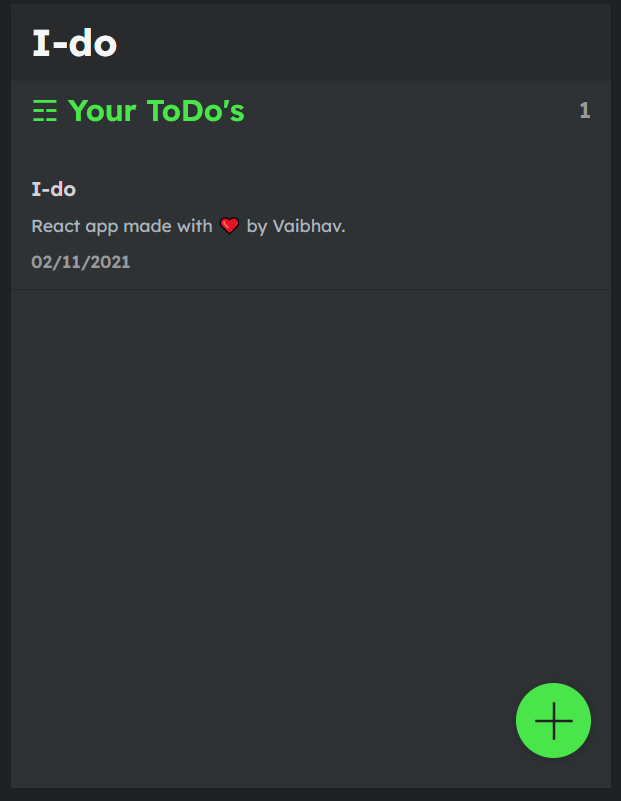

# I-do

React application that uses json server to store all your important tasks.

## Run the app

clone the project

```bash
  git clone https://github.com/iamVaibhav100/react-notes-app.git
```

move to the directory

```bash
  cd react-notes-app
```

Install dependencies

```bash
  npm install
```

Run the application!

```bash
  npm run server
```

This cmd starts json server, if you have not installed, just run npm i -g json-server

```bash
  npm start
```

This starts the React server.

## Demo



Made with ❤️ by [Vaibhav](https://iamvaibhav.netlify.app/)
